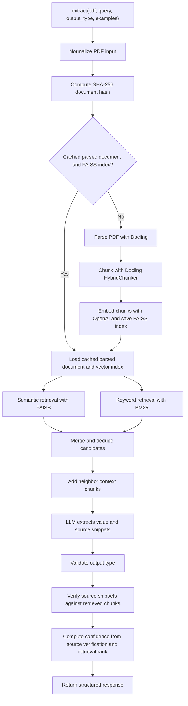

# legal-pdf-extractor

A modular legal PDF extraction pipeline that parses documents with Docling, chunks
with Docling HybridChunker using an OpenAI tokenizer, embeds with OpenAI
embeddings, caches FAISS document indexes by hash, retrieves relevant sections,
and returns typed answers with source attribution.

## Architecture



## Design Decisions

### PDF Normalization

The input layer accepts both file paths and raw PDF bytes. Bytes are written to a
temporary `.pdf` file and cleaned up after extraction. This gives the rest of the
pipeline one stable representation, a local PDF path, while still supporting
API/upload-style callers that naturally provide bytes.


### Document Hashing and Cache

The cache is keyed by a SHA-256 hash of the normalized PDF bytes. This lets
repeated queries against the same legal document reuse the expensive parsed
document and FAISS index instead of reparsing and re-embedding every time.

The hash is based on document content, not the filename. That means the same PDF
renamed or supplied from a different path still maps to the same cached index.

Hashing reads the PDF in fixed-size chunks instead of loading the entire file
into memory at once. This keeps memory usage predictable even for large legal
PDFs.

### Docling Parsing and Chunking

Docling is used for PDF parsing because legal documents often rely on layout,
section headers, numbered clauses, and tables. The parser enables table structure
extraction and keeps OCR disabled because the assignment targets text-based PDFs.

Chunking uses Docling's `HybridChunker` with an OpenAI-compatible tokenizer and
an 800-token limit. The goal is to keep chunks small enough for retrieval and
LLM context, while preserving nearby headings and structural context. The indexed
chunk text is contextualized for better retrieval, and the original chunk text is
kept in metadata as `raw_text` for traceability.

### Vector Index

FAISS `IndexFlatIP` is used as a simple brute-force inner-product index. For the
assignment scale, this is a good tradeoff: it is local, dependency-light, exact
over the stored vectors, and avoids introducing an external vector database.


Embeddings are created in batches and batch requests are executed in parallel
with a bounded worker pool. This keeps indexing faster for large documents while
still controlling API request fanout.

### Retrieval and Neighbor Expansion

Retrieval combines semantic search from FAISS with BM25 keyword search. Semantic
retrieval helps with meaning and paraphrases, while BM25 protects exact legal
terms such as party names, notice periods, governing law, clause labels, and
dates.

After candidate retrieval, the retriever adds a small neighbor window around
matched chunks. Legal answers often depend on nearby clause text, headings, or
conditions split across adjacent chunks, so neighbor expansion gives the LLM more
complete evidence without sending the whole document.

Retrieved chunks are tagged with lightweight metadata showing whether they were
direct candidates or neighbor context, plus the candidate rank that brought them
into the final context. This metadata is used later by the confidence scorer.

### LLM Extraction and Structured Outputs

The OpenAI client uses structured outputs with a strict JSON schema generated
from the requested `output_type`. This means the LLM is constrained to return
only the expected response shape: `value`, `found`, and `sources`.

The prompt also instructs the model to use only retrieved chunks, return
`found=false` when evidence is missing, and copy source snippets verbatim. The
schema controls the shape of the response, while the prompt controls the
evidence-use behavior.

OpenAI embedding and extraction calls use `tenacity` retries with exponential
backoff for transient API, timeout, connection, and rate-limit errors. The OpenAI
SDK's built-in retries are disabled so retry behavior is explicit and owned by
the project.

### Type Validation

Even though the LLM is asked for structured JSON, the result is still validated
in code before returning. Dates must parse as ISO-8601 strings, numbers must be
actual numeric values, arrays must contain the requested scalar type, and missing
answers return `value=null`.

This keeps the model output from becoming the final source of truth for type
correctness.

### Source Verification and Fuzzy Matching

Source attribution is mandatory for legal extraction, so returned snippets are
verified against the retrieved chunks. Exact snippet matches are accepted first.
If the LLM slightly changes whitespace or wording, fuzzy matching is used to
replace the model's snippet with the closest actual passage from the retrieved
evidence.

This balances auditability with practical LLM behavior: the final response should
point to text that actually appears in the document, not a paraphrase.

### Confidence Scoring

Confidence is computed after source verification rather than being delegated to
the LLM. The score is intentionally simple and evidence-based:

- verified source support contributes up to `0.85`
- retrieval rank/proximity contributes up to `0.15`
- no verified source returns `0.0`

Neighbor chunks inherit the rank of the candidate that brought them into the
context window. That way, if the answer appears in nearby context rather than the
exact retrieved hit, the confidence scorer can still credit the original
retrieval signal without using raw FAISS or BM25 scores directly.

### Structured Errors

The project defines module-specific error types such as PDF normalization,
parsing, embedding, LLM, type validation, and source verification errors. These
are converted into structured response payloads instead of exposing raw
exceptions to callers.

This gives API and CLI users predictable failure shapes while preserving enough
information to understand which stage failed.

## Potential Improvements

The current design intentionally stays simple for the assignment: it avoids extra
models and heavier orchestration while still meeting the core
requirements around typed extraction, source attribution, caching, and modularity.
Some useful future improvements would be:

- Add a reranker after semantic and BM25 retrieval so all candidates are scored
  by a single query/chunk relevance model before sending context to the LLM.
- Use Reciprocal Rank Fusion (RRF) instead of simple candidate merging, so chunks
  that rank well in both semantic search and BM25 are promoted more fairly.
- Add query expansion to rewrite or augment the user's natural-language query
  with likely legal synonyms, clause names, and related formulations.
- Use contextual RAG by asking an LLM to generate richer contextualized chunk text
  from each page/chunk before embedding, improving retrieval for references that
  depend on surrounding section context.
- Pre-generate likely questions and answers for every chunk, then index those
  alongside the original text to improve recall for common legal extraction
  queries.

## Setup

Install `uv` if it is not already available:

```bash
curl -LsSf https://astral.sh/uv/install.sh | sh
uv --version
```

If `uv` is not found immediately after installation, open a new terminal or add
`~/.local/bin` to your `PATH`.

Install dependencies:

```bash
uv sync
```

Create a local `.env` file:

```bash
cp .env.example .env
```

Then fill in:

```text
OPENAI_API_KEY=...
```

The OpenAI model and cache directory are code defaults in
`legal_pdf_extractor.config`.

## Usage

Sample legal PDFs for testing are available at:

```text
/Users/ud2195/legal-pdf-extractor/CUAD_v1/full_contract_pdf
```

CLI:

```bash
uv run legal-pdf-extract extract \
  --pdf path/to/contract.pdf \
  --query "List the named tenants involved ?" \
  --output-type "array[string]"
```

Python:

```python
from legal_pdf_extractor import extract

result = extract(
    pdf="path/to/contract.pdf",
    query="Who is the tenant?",
    output_type="string",
)
```

Response shape:

```json
{
  "value": "Greenfield Properties LLC",
  "found": true,
  "confidence": 0.97,
  "sources": [
    {
      "page": 3,
      "snippet": "Tenant: Greenfield Properties LLC"
    }
  ]
}
```

Supported output types:

- `string`
- `date`
- `number`
- `array[string]`
- `array[date]`
- `array[number]`

## Demos

Notebook:

```bash
uv run jupyter notebook demos/notebooks/test_notebook.ipynb
```

Streamlit:

```bash
uv run streamlit run demos/streamlit_app.py
```

## Tests

```bash
uv run pytest
uv run ruff check .
uv run mypy src
```
